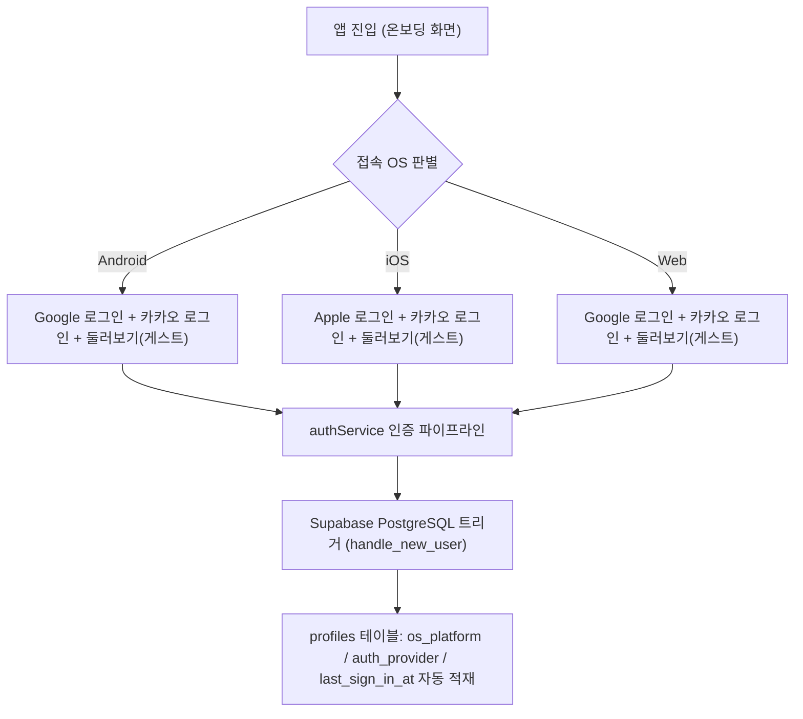

# WHEREGO (travel_APP) 프로젝트 종합 개발 진척 보고서

- **문서 버전**: v1.0
- **작성 일자**: 2026-09-24
- **작성 기준**: Git 브랜치 `main` (커밋 `b3dfacc` 기준)
- **대상 독자**: 프로젝트 오너, 개발팀, 기획/디자인 담당자
- **관련 핵심 문서**:
  - 통합 기획서: [`docs/0.PRD/여행_계획_공유_기록_서비스_통합기획서_v0.3.docx`](file:///j:/개인%20프로젝트/App/travel_APP/docs/0.PRD/여행_계획_공유_기록_서비스_통합기획서_v0.3.docx)
  - UI 디자인 시스템: [`docs/1.uiux/ui_design_system.md`](file:///j:/개인%20프로젝트/App/travel_APP/docs/1.uiux/ui_design_system.md)
  - DB 명세서: [`docs/DB_DICTIONARY.txt`](file:///j:/개인%20프로젝트/App/travel_APP/docs/DB_DICTIONARY.txt)
  - 개발 규칙: [`AGENTS.md`](file:///j:/개인%20프로젝트/App/travel_APP/AGENTS.md)

---

## 1. 프로젝트 개요 (Executive Summary)

### 1.1 프로젝트 목적

**WHEREGO (travel_APP)**는 여행의 모든 단계인 **계획(PLAN) ➔ 공유(SHARE) ➔ 실시간 여행(TRAVEL) ➔ 기록/정산(RECORD)**을 분절 없이 매끄럽게 연결하는 올인원 크로스 플랫폼(Android, iOS, Web) 여행 서비스입니다.

### 1.2 서비스 핵심 가치 (4대 라이프사이클)

```mermaid
graph LR
    A["① 여행 계획 (PLAN)"] --> B["② 동행 공유 (SHARE)"]
    B --> C["③ 현장 여행 (TRAVEL)"]
    C --> D["④ 기록/정산 (RECORD)"]

    subgraph A["① 여행 계획 (PLAN)"]
      A1["DAY 자동 계산"]
      A2["시간대별 세부 일정"]
      A3["카테고리별 동선"]
    end
    subgraph B["② 동행 공유 (SHARE)"]
      B1["초대 코드 동행 초대"]
      B2["방장/편집자 권한"]
      B3["웹 읽기 링크 발급"]
    end
    subgraph C["③ 현장 여행 (TRAVEL)"]
      C1["GPS 반경 체크인"]
      C2["실시간 이동 안내"]
      C3["준비물 체크리스트"]
    end
    subgraph D["④ 기록/정산 (RECORD)"]
      D1["예산 대비 실지출 차트"]
      D2["영수증 OCR 스크랩"]
      D3["방문 발자국 지도"]
    end
```



### 1.3 핵심 기술 스택 종합

| 레이어                  | 기술 스택                                          | 선정 사유 및 역할                                                                                |
| :---------------------- | :------------------------------------------------- | :----------------------------------------------------------------------------------------------- |
| **모바일/웹 코어**      | **React Native (0.86.3), Expo SDK 57, React 19.2** | 하나의 코드베이스로 Android, iOS, Web을 동시 타깃하며 Expo Router 기반의 일관된 파일 라우팅 제공 |
| **언어/타입**           | **TypeScript 5.8 (Strict Mode)**                   | 컴파일 단계에서 모든 도메인 인터페이스 엄격 검증                                                 |
| **상태 관리**           | **Zustand, TanStack Query v5**                     | 앱 전역 UI/동행 상태(Zustand)와 서버 비동기 캐시/동기화(TanStack Query)의 역할 분리              |
| **백엔드/데이터베이스** | **Supabase (PostgreSQL 15+, Auth, Storage)**       | RLS(행 단위 보안)가 적용된 13개 테이블, 인증(Auth) 트리거, 미디어 스토리지 통합                  |
| **마이크로서비스 API**  | **Cloudflare Workers + Hono**                      | 글로벌 엣지 런타임에서 장소 검색 프록시, 난수 공유 링크 발급, 영수증 OCR 스텁 수행               |
| **로컬 보안 저장소**    | **Expo SecureStore**                               | 플랫폼별 하드웨어 키체인/Keystore 연동 (게스트 고유 식별자 및 DB 보안 키 이중 암호화 보관)       |
| **폼 및 입력 검증**     | **React Hook Form + Zod**                          | 일정 추가, 가계부 지출, 프로필 변경 시 무결성 검증                                               |
| **빌드 & 배포**         | **Expo EAS Build**                                 | 실기기 설치용 APK(Preview) 및 스토어 제출용 AAB/IPA(Production) 파이프라인 수립                  |

---

## 2. 모노레포 구조 및 시스템 아키텍처

`Turborepo` 및 `npm workspaces` 표준을 적용하여 프론트엔드, 백엔드 마이크로서비스, 공통 도메인 및 검증 패키지를 계층화하여 분리했습니다.

```text
travel_APP/
├── apps/
│   ├── mobile/             # React Native + Expo 57 모바일 클라이언트 앱
│   │   ├── src/app/        # Expo Router 화면 구성 (소셜 온보딩, 3대 탭, 여행 상세 5대 허브)
│   │   ├── src/components/ # 재사용 가능한 원자적 UI 컴포넌트
│   │   ├── src/services/   # 소셜 인증, Supabase 연동, 보안 키체인 암호화 모듈
│   │   └── src/stores/     # Zustand 여행/동행/발자국 전역 스토어
│   ├── api/                # Cloudflare Workers + Hono 마이크로서비스
│   │   └── src/index.ts    # 헬스체크, 장소 검색 프록시, 난수 공유 토큰, 영수증 OCR
│   └── web/                # 향후 확장용 웹 클라이언트 스캐폴딩
├── packages/
│   ├── domain/             # 13개 핵심 데이터 모델 및 타입 정의 (@wherego/domain)
│   ├── validation/         # Zod 유효성 검증 스키마 모음 (@wherego/validation)
│   └── api-client/         # Fetch 기반 공용 API 클라이언트 (@wherego/api-client)
├── supabase/
│   ├── migrations/         # 13개 테이블 DDL 및 RLS 보안 정책 마이그레이션 SQL
│   └── seed.sql            # 초기 목업 시드 데이터
└── docs/
    ├── 0.PRD/              # 여행_계획_공유_기록_서비스_통합기획서_v0.3.docx
    ├── 1.uiux/             # UI 디자인 시스템 명세서 (ui_design_system.md)
    ├── DB_DICTIONARY.txt   # 13개 테이블 및 컬럼 속성 사전 (v1.4)
    ├── DEPLOYMENT.md       # 멀티플랫폼 빌드/배포 가이드
    └── PROJECT_PROGRESS_REPORT.md # [본 보고서]
```

---

## 3. 현재까지 완료된 핵심 구현 내역 (Achievements)

### 3.1 데이터베이스 모델링 및 13개 테이블 스키마 구축 (`docs/DB_DICTIONARY.txt` v1.4)

기획서 v0.3에 명시된 모든 도메인을 수용하는 정규화된 PostgreSQL DDL 및 RLS 정책을 완료했습니다.

1. **`profiles` (사용자 프로필)**:
   - Supabase Auth(`auth.users`) 연동.
   - 사용자 닉네임, 아바타 URL, 자기소개(`bio`), 선호 여행 스타일 태그(`travel_styles`), 연락처(`phone`), 가입 접속 기기(`os_platform`), 인증 제공자(`auth_provider`), 최종 로그인 시각(`last_sign_in_at`).
2. **`trips` (여행 마스터)**:
   - 여행 제목, 대상 국가, 대표 도시, 여행 기간(`start_date` ~ `end_date`), 대표 커버 테마 색상, 6~8자리 동행 초대 코드(`invite_code`), 진행 상태 Enum(`DRAFT`, `PLANNED`, `IN_PROGRESS`, `COMPLETED`, `ARCHIVED`).
3. **`trip_members` (동행자 및 역할 권한)**:
   - 멤버별 역할(`owner`: 방장, `editor`: 편집자, `viewer`: 단순 뷰어) 제어.
4. **`trip_days` (여행 일차별 날짜)**:
   - 여행 시작일~종료일에 따라 일차(DAY 1, DAY 2, ...) 및 달력 날짜가 자동 생성/동기화되는 데이터셋.
5. **`places` (장소 마스터)**:
   - 전 세계 장소의 좌표(위도/경도 WGS84), 카테고리(`stay`, `food`, `cafe`, `sightseeing`, `activity`, `etc`), 주소, 전화번호 캐싱.
6. **`itinerary_items` (세부 일정 아이템)**:
   - 일차별 방문 타임라인, 순서(`sort_order`), 방문 시간, 예상 비용, 실제 비용, 일정 성격 6종(`PLACE`, `TRANSPORT`, `STAY`, `RESERVATION`, `TODO`, `MEMO`), 이동 수단 안내(`transit_info`), 방문 완료 플래그.
7. **`expenses` (가계부 지출 내역)**:
   - 예상 경비(`is_actual = false`)와 실제 지출(`is_actual = true`)의 2원화 관리.
   - 카테고리(`food`, `transport`, `stay`, `activity`, `shopping`, `etc`), 통화 코드(`KRW`, `USD`, `JPY`), 결제자 매핑.
8. **`checklists` (준비물 체크리스트)**:
   - 여행 전 짐 챙기기 필수품 관리, 챙김 완료 토글(`is_completed`), 동행 멤버별 준비 담당자 배정(`assigned_user_id`).
9. **`visits` (방문 발자국 / 체크인)**:
   - 현장 방문 인증 기록. GPS 반경 200m 인증(`gps`), 사용자 수동 인증(`manual`), 영수증 스캔 인증(`receipt`).
10. **`reviews` (방문 장소 후기 및 별점)**:
    - 방문 발자국 연계 1~5점 별점 및 감성 텍스트 후기.
11. **`receipts` (영수증 OCR 파싱 내역)**:
    - 가맹점명, 결제 일시, 승인 금액, OCR 추출 원본 텍스트 관리.
12. **`attachments` (미디어 첨부파일)**:
    - Supabase Storage 버킷에 적재되는 사진/영수증 파일 경로 매핑.
13. **`share_links` (외부 읽기 전용 공유 링크)**:
    - 웹 브라우저를 통해 비로그인 외부인에게 일정표를 공유하는 고유 토큰 및 유효기간 관리.

> **보안 정책 (RLS)**:
> 13개 테이블 전부에 PostgreSQL RLS를 적용하여 여행 소유자(`owner`) 및 등록된 동행 멤버(`trip_members`)만 데이터를 조회/수정/삭제할 수 있도록 엄격히 격리했습니다. 공용 장소(`places`)는 인증 여부에 따른 읽기/쓰기 분리 정책을 적용했습니다.

---

### 3.2 플랫폼별(Android / iOS / Web) 소셜 인증 및 기기 로그 시스템

플랫폼별 심사 가이드라인과 UX 최적화를 위해 원클릭 소셜 인증을 분기 처리했습니다.



- **Android 최적화**: Google One-Tap / OAuth, Kakao SDK 간편 로그인, 게스트 모드.
- **iOS 최적화**: Apple App Store 가이드라인 필수 충족을 위한 Sign in with Apple, Kakao SDK, 게스트 모드.
- **영구 게스트 세션**: 비로그인 사용자가 앱을 경험할 수 있도록 Expo SecureStore에 난수 디바이스 세션 식별자를 영구 보관하여 앱 재시작 시에도 로컬 데이터 유지.
- **데이터베이스 자동 동기화**: 신규 가입 또는 로그인 시 PostgreSQL 트리거(`handle_new_user`)가 실행되어 접속 OS와 인증 제공자가 `profiles` 테이블에 자동 적재됨.

---

### 3.3 프론트엔드 모바일 앱 5대 핵심 화면 구현 (`apps/mobile`)

#### 1) 온보딩 및 소셜 로그인 (`src/app/index.tsx`)

- 감성적인 Hero 일러스트 배너 및 서비스 소개 문구.
- 접속 플랫폼을 감지하여 AOS/iOS 전용 로그인 버튼 세트 동적 렌더링.
- 로그인 없이 즉시 체험 가능한 '둘러보기(게스트)' 모드 지원.

#### 2) [탭 1] 내 여행 대시보드 (`src/app/(tabs)/index.tsx`)

- **상태별 4대 필터링**: 전체, 예정된 여행(`PLANNED`), 여행 중(`IN_PROGRESS`), 다녀온 여행(`COMPLETED`).
- **새 여행 만들기 모달**:
  - 여행 제목, 대상 국가, 도시, 일정 기간(시작일~종료일), 테마 대표 색상 선택.
  - 생성 즉시 시작일과 종료일 간의 차이를 계산하여 `DAY 1~N` 일차별 레코드를 자동 생성하는 **DAY 계산 엔진** 연동.
- **여행 카드 인터랙션**: D-Day 뱃지, 일정 기간, 도시 태그, 상세 화면 원클릭 라우팅.

#### 3) [상세] 여행 상세 5대 서브 허브 (`src/app/trips/[id].tsx`)

단일 여행 내에서 기획서 v0.3에 명시된 5대 핵심 기능을 전환할 수 있는 통합 상세 화면을 구축했습니다.

| 서브 탭                      | 주요 기능 및 화면 구현 내용                                                                                                                                                                                                                       |
| :--------------------------- | :------------------------------------------------------------------------------------------------------------------------------------------------------------------------------------------------------------------------------------------------ |
| **① 일정 (Timeline)**        | • DAY 1, DAY 2, DAY 3 일차별 수평 스크롤 탭<br>• 시간대별(`HH:MM`) 일정 카드 및 순서 번호 마커(①, ②, ③...)<br>• 장소 성격(식당, 명소, 숙소, 이동, 예약, 메모) 배지 및 체크인 토글<br>• 일정 추가 모달 (장소 검색, 소요시간, 예상 비용, 메모 입력) |
| **② 지도 (Map & Route)**     | • 인터랙티브 동선 뷰 및 방문 지점 순서 연결선<br>• 방문 지점 간의 대중교통/도보 이동 안내(`transit_info`) 시각화                                                                                                                                  |
| **③ 가계부 (Expenses)**      | • 총 예산 대비 실제 지출 진행률 프로그레스 바<br>• 카테고리별(식비, 교통, 숙소, 쇼핑 등) 지출 분포 지표<br>• 예상 경비 vs 실제 지출 2원화 필터 및 신규 지출 등록 모달                                                                             |
| **④ 체크리스트 (Checklist)** | • 여행 전 필수 짐 챙기기 항목 목록<br>• 체크박스 터치 시 즉각적인 완료 상태 토글 및 전체 달성률 게이지 바<br>• 신규 준비물 추가 모달                                                                                                              |
| **⑤ 동행 멤버 (Members)**    | • 고유 6자리 여행 초대 코드 발급 및 원클릭 클립보드 복사<br>• 카카오톡 및 SNS 공유 링크 연동 인터페이스<br>• 참여 멤버 목록 및 방장(`owner`), 편집자(`editor`), 뷰어(`viewer`) 권한 배지                                                          |

#### 4) [탭 2] 발자국 / 스크랩북 (`src/app/(tabs)/footprints.tsx`)

- 다녀온 여행지들의 인증된 발자국 타임라인 및 갤러리 모아보기.
- 현장 GPS 좌표 기반 반경 200m 방문 인증 버튼 및 수동 체크인 기능.
- 별점(1~5점) 및 사진 방문 후기 작성 플로우.

#### 5) [탭 3] 마이페이지 (`src/app/(tabs)/my.tsx`)

- **프로필 관리**: 프로필 수정 모달을 통해 닉네임, 한 줄 자기소개(`bio`), 선호 여행 스타일(힐링, 맛집, 액티비티, 호캉스 등 태그 선택), 비상 연락처 변경 및 Supabase 동기화.
- **접속 상태 배지**: 현재 접속 중인 기기 OS(Android, iOS, Web) 및 로그인 계정 제공자(Google, Kakao, Apple, Guest) 실시간 표시.
- **DB 보안 무결성 검증 센터**:
  - 보안 식별 키(`24541c7e-d148-46d9-80ef-f647ad649eb1`)의 Base64 대칭키 암호화 + Expo SecureStore 저장 상태 확인.
  - 사용자가 직접 "복호화 무결성 테스트"를 실행하여 하드웨어 키체인 보안성을 즉시 검증할 수 있는 디버깅 UI 제공.
- **앱 환경 설정**: GPS 위치 권한, 오프라인 모드 토글, 버전 정보 및 안전한 로그아웃/게스트 초기화 기능.

---

### 3.4 엣지 마이크로서비스 (`apps/api`)

Cloudflare Workers 기반의 Hono 초경량 서버리스 API를 구현하여 네이티브 앱과의 통신을 분담했습니다:

- `GET /health`: 글로벌 엣지 런타임 상태 모니터링.
- `GET /api/places/search`: 장소 및 상호 검색 프록시.
- `POST /api/share/link`: 웹 공유를 위한 안전한 64비트 난수 토큰 발급.
- `POST /api/receipt/ocr`: 영수증 결제 금액 및 상호명 비전 OCR 추출 스텁 파이프라인.

---

## 4. 품질 관리 및 개발 규칙 준수 현황

프로젝트 거버넌스 규칙([`AGENTS.md`](file:///j:/개인%20프로젝트/App/travel_APP/AGENTS.md))을 100% 준수하여 개발을 진행했습니다.

```text
[검증 상태 체크리스트]
[✔] TypeScript 엄격 모드 (Strict Typecheck) : 100% 통과 (0 error)
[✔] ESLint 9 정적 분석 검사 : 100% 통과 (0 warning, 0 error)
[✔] Prettier 코드 포맷 서식 : 100% 일치
[✔] 단일 명령 원칙 (Single Responsibility) : 모든 함수가 단 하나의 명령만을 수행하도록 세분화
[✔] 전수 한글 주석 : 모든 함수 선언부 및 비즈니스 로직에 명확한 한글 설명 주석 작성
[✔] DB 명세서 최신화 : docs/DB_DICTIONARY.txt v1.4 동기화 완료
[✔] Git 커밋 컨벤션 : '타이틀 : 세부설명' 형식 엄격 준수
```

---

## 5. 현재 개발 진척도 및 향후 로드맵 (Roadmap)

### 5.1 기능별 진척도 요약

| 영역                   | 구현 항목                                                      |  진행률  |                    상태                     |
| :--------------------- | :------------------------------------------------------------- | :------: | :-----------------------------------------: |
| **인프라/아키텍처**    | 모노레포 구축, 패키지 분리, TypeScript Strict, ESLint          | **100%** |                    완료                     |
| **데이터베이스**       | 13개 테이블 DDL, 인덱스, RLS 보안 정책, DB 사전 v1.4           | **100%** |                    완료                     |
| **사용자 인증**        | 플랫폼별 소셜 인증, 게스트 세션 영구 보관, OS 기기 로그        | **100%** |                    완료                     |
| **여행 관리 (PLAN)**   | 여행 생성, DAY 자동 계산, 5대 허브(일정/지도/가계부/체크/멤버) | **95%**  | 핵심 구현 완료 (외부 지도 뷰어 실연동 준비) |
| **기록/정산 (RECORD)** | 가계부 통계 차트, 발자국 타임라인, 프로필 수정, 보안 키체인    | **90%**  |               핵심 구현 완료                |
| **외부 연동 (API)**    | 카카오맵/구글맵 네이티브 지도 SDK 연동, 실제 영수증 OCR 엔진   | **35%**  |    스텁 구축 완료, 상용 API 키 연동 대기    |

- **전체 프로젝트 진척도**: **약 75%** 완료

### 5.2 향후 진행 예정 과제 (Next Steps)

1. **네이티브 지도 SDK 실연동**:
   - `react-native-maps` 또는 카카오맵/구글맵 Webview 기반 실시간 경로 폴리라인 및 커스텀 마커 렌더링.
2. **상용 영수증 OCR 비전 AI 파이프라인 연동**:
   - Clova OCR 또는 Google Cloud Vision API를 `apps/api`에 연결하여 영수증 촬영 즉시 가계부 자동 입력 구현.
3. **Supabase Realtime 동행자 실시간 협업 동기화**:
   - 여러 명의 동행자가 동시에 일정을 추가하거나 체크리스트를 수정할 때 웹소켓을 통한 실시간 반영 처리.
4. **EAS Build를 통한 스토어 배포 검증**:
   - 실기기 Android APK 테스트 빌드 및 iOS TestFlight 배포 심사 준비.

---

_보고서 작성 완료: travel_APP 개발팀_
