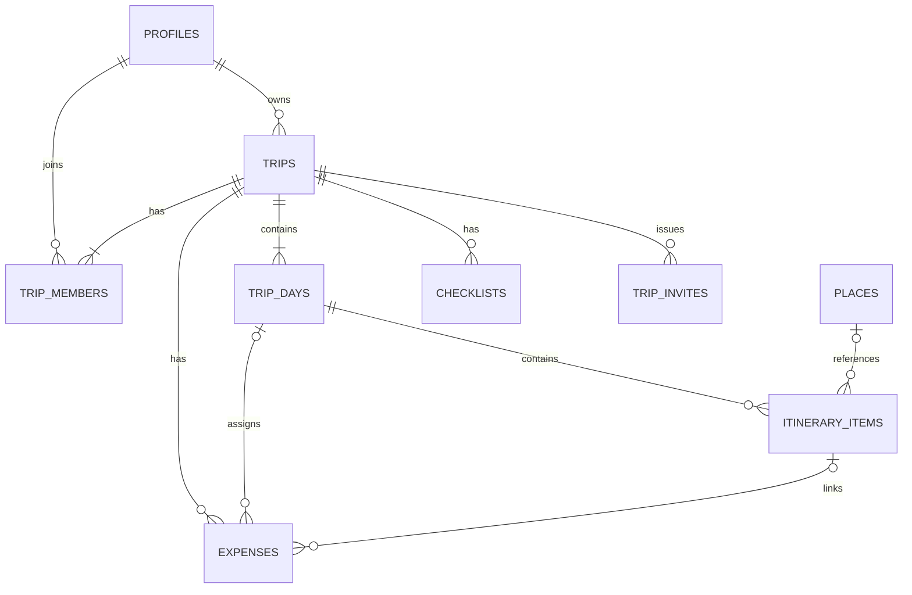

# WHEREGO 데이터 저장과 동기화 설계

- 버전: v0.1 / 작성일: 2026-10-02 / 상태: **목표 모델 제안, M1 일부 구현·로컬 검증**
- DB 식별: Supabase 프로젝트의 PostgreSQL `postgres`, 애플리케이션 스키마 `public`
- 현재 근거: `supabase/migrations/` 기존 3개+M1 2개 SQL, domain/validation의 foundation 모듈, [DB 사전 v1.5](../DB_DICTIONARY.txt)
- 구현 범위와 미실행 원격 적용은 [M0·M1 실행 기록](M0_M1_EXECUTION.md)을 참조한다. 아래 기능별 원자 명령 전부가 구현된 것은 아니다.
- 관련: MVP-01~10, D-01/04/05/08/09/10/12/13/14

## 1. 어디에 무엇을 저장하는가

| 데이터                       | 원본/저장 위치                         | 앱에서의 역할            | 복원/삭제                                        |
| ---------------------------- | -------------------------------------- | ------------------------ | ------------------------------------------------ |
| 계정·인증                    | Supabase Auth                          | 서버 검증된 세션         | 실제 세션 복원·로그아웃 해제                     |
| 프로필                       | PostgreSQL profiles                    | 조회 캐시 및 편집 입력   | 로그인 후 본인 조회                              |
| 여행·DAY·일정·비용·체크·멤버 | PostgreSQL public                      | TanStack Query 조회 캐시 | 앱 재실행은 DB 재조회, 로그아웃 캐시 제거        |
| 장소                         | PostgreSQL places, 공급자 허용 범위    | 저장 좌표로 지도 표시    | 공급자 정책에 따른 유지/갱신                     |
| 초대                         | PostgreSQL trip_invites(신규 제안)     | 발급 직후 링크 공유·수락 | 만료/철회/소비 서버 검사                         |
| 인증 토큰                    | 모바일 SecureStore·웹 Auth 저장 어댑터 | 세션 복원                | 계정 전환/로그아웃 정리                          |
| 선택 탭·DAY·필터             | Zustand UI 상태                        | 화면 상태만              | 계정·여행별 분리; 참조 대상 삭제 시 초기화       |
| 미저장 입력                  | 화면 메모리                            | 실패 후 수정/재시도      | 종료 시 보존 보장 없음, 이탈 안내                |
| 조회 캐시                    | 기본 메모리 캐시                       | 오래된 결과 표시·재조회  | 오프라인 보존 보장 없음; 디스크 캐시는 별도 승인 |
| 사진·영수증/P1               | private Object Storage + DB 메타데이터 | 접근 확인 후 서명 URL    | 파일/메타데이터 정리와 보존 정책 추가            |

Zustand 배열과 `travelStorage.ts` 메모리 저장소는 여행 원본으로 사용하지 않는다. `persist`만 추가해도 다른 기기 협업·서버 권한이 해결되지 않는다. 인증 토큰 저장소에 여행 전체나 영수증을 넣지 않는다.

MVP는 온라인 쓰기 전용 권장안이다. 화면 실패 입력은 “저장 전”이며 성공 토스트를 표시하지 않는다. 앱 재실행 후 서버에서 복원할 데이터와 임시 폼 데이터의 경계를 사용자에게 안내한다.

## 2. 관계와 원본 규칙

- 하나의 여행은 owner 한 명과 DAY1~N을 가진다. owner도 trip_members에 한 행을 두며 trips.user_id와 일치하도록 서버/DB에서 보장한다.
- 일정은 DAY에 귀속하고 장소는 선택 연결이다. 장소 없는 메모/이동에 가짜 place_id나 좌표를 만들지 않는다.
- 비용은 trip 필수, DAY/일정 선택이다. 연결 일정→DAY→여행과 비용의 trip_id가 반드시 일치한다.
- 일정별 예상/실제 비용 표시와 DAY/여행 합계는 expenses에서 계산한다. 별도 숫자 원본을 이중 저장하지 않는다.
- 장소 마스터에는 개인 일정 메모를 저장하지 않는다. provider 장소와 직접 등록 사적 장소의 접근 범위를 구분한다.

## 3. 공통 필드·제약

아래 명세는 목표안이다. 각 표의 타입·기본값·제약을 구현 시 DB 사전과 실제 SQL/TypeScript에 반영한다.

| 규칙        | 목표                                                                              |
| ----------- | --------------------------------------------------------------------------------- |
| PK          | DB 생성 UUID, 신규 클라이언트 임시 ID를 원본 ID로 확정하지 않음                   |
| 소유/작성자 | 검증한 Auth UUID에서 서버 설정, client의 userId 신뢰 금지                         |
| 시각        | 생성/수정/가입/만료는 TIMESTAMPTZ UTC, 서버 생성                                  |
| 여행 날짜   | DATE, 시간대 변환으로 하루 앞/뒤로 변형하지 않음                                  |
| 일정 시각   | HH:MM 로컬 벽시계 TIME 또는 검증 VARCHAR, travel timezone과 함께 해석             |
| 돈          | NUMERIC(12,2), API decimal string. JS 부동소수 합계를 저장 원본으로 삼지 않음     |
| 버전        | trips.version BIGINT ≥1; 모든 여행 하위 쓰기 때 증가. profiles.version은 별도     |
| 삭제        | MVP는 여행 하위 데이터 트랜잭션 hard delete 권장. 명시적 사용자 확인 및 역할 검사 |
| 참조 검증   | 교차 여행 연결·owner 중복·순서 누락·음수 금액은 서버/DB에서 차단                  |

공통 필드 `created_at`, `updated_at`은 NOT NULL·서버 NOW(). 수정 가능한 모든 핵심 행에 updated_at을 추가한다. `created_by/updated_by`를 추가하는 행은 profiles UUID FK이며 삭제 정책은 계정 삭제 결정에 맞춰 확정한다.

## 4. MVP 목표 테이블과 도메인

### 4.1 profiles → Profile (MVP-01)

| 컬럼                       | 타입/NULL/기본           | 제약·설명                                           |
| -------------------------- | ------------------------ | --------------------------------------------------- |
| id                         | UUID/필수                | PK·auth.users FK, 동일 Auth UUID                    |
| nickname                   | VARCHAR(50)/필수         | trim 후 1~50자, 가입 기본 제안                      |
| bio                        | TEXT/선택                | 최대 200자, 본인 자기소개                           |
| avatar_url                 | TEXT/선택                | 기존 필드 유지, MVP 업로드 필수 아님                |
| travel_styles, phone       | TEXT[]/VARCHAR(30), 선택 | 기존 확장 필드, 동행/공개 응답 제외                 |
| os_platform, auth_provider | VARCHAR(20)/필수         | 현재 컬럼 재사용. 제공자는 검증된 세션에서 반영     |
| last_sign_in_at            | TIMESTAMPTZ/선택         | 실제 로그인 성공 기록, 프로필 수정 시 변경하지 않음 |
| version                    | BIGINT/필수/1            | 낙관적 수정 검사용, 신규 제안                       |
| created_at, updated_at     | TIMESTAMPTZ/필수/NOW()   | 생성·수정 시각                                      |

가입 트리거는 실제 Auth 신규 가입에만 적용한다. 로그인 UI가 provider 이름을 전달했다고 인증을 완료한 것으로 기록하지 않는다. 프로필 공개 전체 SELECT 대신 본인 전체·멤버 최소 투영으로 분리한다.

### 4.2 trips → Trip (MVP-02/03/10)

| 컬럼                   | 타입/NULL/기본           | 제약·설명                                                 |
| ---------------------- | ------------------------ | --------------------------------------------------------- |
| id                     | UUID/필수/DB UUID        | PK                                                        |
| user_id                | UUID/필수                | profiles FK, owner, 변경 금지(MVP 소유권 이전 제외)       |
| title                  | VARCHAR(100)/필수        | 서비스 입력 상한 50자, 생략은 서버 자동 생성              |
| country, city          | VARCHAR(50)/필수         | trim 후 1~50자                                            |
| start_date, end_date   | DATE/필수                | 시작≤종료, 1~90일 권장                                    |
| timezone               | TEXT/필수                | 유효 IANA 여행 시간대, 신규 제안                          |
| default_currency       | VARCHAR(3)/필수/KRW 후보 | 허용 통화, 입력 기본값만 변경, 기존 비용 환산 없음        |
| status                 | trip_status/필수/PLANNED | 기존 타입 유지, display_status는 날짜 계산 투영           |
| cover_color            | VARCHAR(20)/선택         | 허용 팔레트 색상                                          |
| invite_code            | VARCHAR(20)/선택         | 기존 호환 필드. MVP 신규 참여 권한의 근거로 사용하지 않음 |
| version                | BIGINT/필수/1            | 모든 하위 변경을 포함하는 여행 버전, 신규 제안            |
| created_at, updated_at | TIMESTAMPTZ/필수         | 공통 생성·수정 시각                                       |

`displayStatus`는 DRAFT/ARCHIVED 우선, 그 외 여행 시간대 today와 DATE 범위를 비교해 PLANNED/IN_PROGRESS/COMPLETED 반환. 기존 저장 status가 과거 수동 값이어도 두 체계를 섞어 사용하지 않도록 이행한다(D-12).

### 4.3 trip_members → TripMember (MVP-07)

| 컬럼             | 타입/NULL/기본          | 제약·설명                                  |
| ---------------- | ----------------------- | ------------------------------------------ |
| id               | UUID/필수/DB UUID       | PK                                         |
| trip_id, user_id | UUID/필수               | trips/profiles FK, UNIQUE(trip_id,user_id) |
| role             | member_role/필수/viewer | owner/editor/viewer, owner는 서버 생성만   |
| joined_at        | TIMESTAMPTZ/필수/NOW()  | 가입 시각                                  |
| updated_at       | TIMESTAMPTZ/필수/NOW()  | 역할 수정 시각, 신규 제안                  |

여행별 owner 유일 제약과 trips.user_id 일치 검증을 추가한다. 멤버 탈퇴는 비용 paid_by를 자동 삭제하지 않고 이후 표시 정책을 별도 적용한다. Auth 계정 삭제는 단순 FK cascade만으로 공유 여행을 삭제하지 않도록 출시 전 재검토한다.

### 4.4 trip_days → TripDay (MVP-03)

| 컬럼                   | 타입/NULL/기본    | 제약·설명                                         |
| ---------------------- | ----------------- | ------------------------------------------------- |
| id                     | UUID/필수/DB UUID | PK, 같은 날짜에 유지                              |
| trip_id                | UUID/필수         | trips FK, 여행 삭제 시 CASCADE                    |
| day_number             | INT/필수          | ≥1, UNIQUE(trip_id,day_number)                    |
| trip_date              | DATE/필수         | UNIQUE(trip_id,trip_date) 신규 제약, 여행 기간 내 |
| created_at, updated_at | TIMESTAMPTZ/필수  | 번호 재계산 시 updated_at                         |

시작~종료 inclusive 날짜를 서버에서 생성한다. DB 저장 시 일차 번호/날짜의 연속성을 확인한다. 기간 수정의 번호 재배치는 유일 제약과 충돌하지 않도록 한 트랜잭션에서 처리한다.

### 4.5 places → Place (MVP-05/06)

| 컬럼                   | 타입/NULL/기본               | 제약·설명                                                   |
| ---------------------- | ---------------------------- | ----------------------------------------------------------- |
| id                     | UUID/필수/DB UUID            | PK                                                          |
| name                   | VARCHAR(150)/필수            | 1~150자                                                     |
| address, phone         | TEXT/VARCHAR(30), 선택       | provider 허용 범위만 저장                                   |
| latitude, longitude    | NUMERIC(10,7)/선택           | 쌍 모두 null 또는 유효 범위, 0을 누락으로 처리 금지         |
| category               | place_category/필수/etc 후보 | 기존 분류 값                                                |
| provider               | VARCHAR(30)/필수             | 선정 공급자명 또는 manual, 신규 제안                        |
| external_place_id      | TEXT/선택                    | provider인 경우 필수, provider+ID 유일                      |
| scope_trip_id          | UUID/선택                    | manual은 필수·여행 FK; provider는 null. 직접 등록 접근 범위 |
| fetched_at, updated_at | TIMESTAMPTZ/선택·필수        | 정보 갱신 시각                                              |
| created_at             | TIMESTAMPTZ/필수             | 등록 시각                                                   |

provider 정보는 저장 허용 여부 확정 후 최소 필드만 보관한다. `manual`은 여행 내부 장소이며 다른 여행에서 이름이 같아도 전역 병합하지 않는다. 전역 provider 마스터도 익명 대량 조회보다 인증된 일정/검색 API를 통한 최소 응답이 권장이다.

### 4.6 itinerary_items → ItineraryItem (MVP-04)

| 컬럼                   | 타입/NULL/기본            | 제약·설명                                                 |
| ---------------------- | ------------------------- | --------------------------------------------------------- |
| id                     | UUID/필수/DB UUID         | PK                                                        |
| trip_day_id            | UUID/필수                 | trip_days FK, 여행 삭제 시 CASCADE                        |
| place_id               | UUID/선택                 | places FK, 삭제 시 RESTRICT 권장; 현행 NOT NULL 변경 필요 |
| type                   | VARCHAR(20)/필수/PLACE    | 6유형 CHECK, 신규 실제 SQL 필요                           |
| title                  | VARCHAR(100)/필수         | 1~100자, 신규 실제 SQL 필요                               |
| time_slot              | TIME 또는 VARCHAR(5)/선택 | HH:MM, 초는 MVP 미사용                                    |
| sort_order             | INT/필수                  | ≥1, DAY 내 서버 부여. 정렬 동률 허용하지 않음             |
| memo                   | TEXT/선택                 | 최대 300자                                                |
| created_by, updated_by | UUID/필수                 | profiles FK, 서버 actor 기록                              |
| created_at, updated_at | TIMESTAMPTZ/필수          | 공통 시각                                                 |

`estimatedCost/actualCost`는 expenses에서 계산한 응답 필드로 제공한다. 현행 도메인 선택 필드와 DB 사전의 같은 이름을 물리적 원본 컬럼으로 구현하지 않는다. 메모/이동은 place_id null 허용. PLACE도 직접 등록한 이름 기반 장소로 연결 가능하다.

### 4.7 expenses → Expense (MVP-08)

| 컬럼                   | 타입/NULL/기본            | 제약·설명                                          |
| ---------------------- | ------------------------- | -------------------------------------------------- |
| id                     | UUID/필수/DB UUID         | PK                                                 |
| trip_id                | UUID/필수                 | trips FK                                           |
| trip_day_id            | UUID/선택                 | 같은 여행 DAY, 삭제 시 SET NULL                    |
| schedule_id            | UUID/선택                 | 같은 DAY/여행 일정, 실제 비용 연결 해제 가능       |
| title                  | VARCHAR(100)/필수         | 1~100자                                            |
| amount                 | NUMERIC(12,2)/필수        | >0; KRW/JPY 정수, USD 소수 2자리                   |
| currency               | VARCHAR(3)/필수           | 허용 통화 CHECK, 기존 VARCHAR(10) 축소는 이행 검토 |
| category               | VARCHAR(20)/필수/etc 후보 | food/transport/stay/activity/shopping/etc          |
| is_actual              | BOOLEAN/필수/true         | 예상 false·실제 true                               |
| source                 | VARCHAR(20)/필수/manual   | manual/schedule, receipt는 P1. 신규 제안           |
| paid_by_user_id        | UUID/선택                 | 실제 결제자, 선택 시 현재 여행 멤버                |
| created_by, updated_by | UUID/필수                 | 생성/수정 actor                                    |
| created_at, updated_at | TIMESTAMPTZ/필수          | 공통 시각                                          |

UNIQUE(schedule_id,currency) WHERE source='schedule' AND is_actual=false를 권장한다. 일정 폼은 이 행을 upsert하며 수동 예상비용을 추가하고 싶으면 source=manual로 구분한다. 일정 예상 통화 변경은 기존 schedule 행을 변경하며 여러 행을 남기지 않는다.

비용 연결의 부모 일치는 단순 개별 FK만으로 보장되지 않으므로 트랜잭션 함수/제약 검증을 추가한다. 일정 선택 시 trip_day_id도 해당 일정 DAY로 설정한다. 일정 이동 시 연결 비용 DAY를 갱신한다. 삭제 시 예상 schedule 행 제거·실제 행 schedule_id=null, DAY는 보존.

### 4.8 checklists → ChecklistItem (MVP-09)

| 컬럼                   | 타입/NULL/기본     | 제약·설명                              |
| ---------------------- | ------------------ | -------------------------------------- |
| id                     | UUID/필수/DB UUID  | PK                                     |
| trip_id                | UUID/필수          | trips FK                               |
| title                  | VARCHAR(100)/필수  | trim 후 1~100자                        |
| is_completed           | BOOLEAN/필수/false | 원하는 상태 저장, XOR toggle 요청 금지 |
| assigned_user_id       | UUID/선택          | 기존 필드, MVP 입력 제외·P1 담당자     |
| created_by, updated_by | UUID/필수          | actor                                  |
| created_at, updated_at | TIMESTAMPTZ/필수   | 공통 시각                              |

### 4.9 trip_invites → TripInvite (신규 제안, MVP-07)

| 컬럼                 | 타입/NULL/기본         | 제약·설명                          |
| -------------------- | ---------------------- | ---------------------------------- |
| id                   | UUID/필수/DB UUID      | PK                                 |
| trip_id              | UUID/필수              | trips FK                           |
| token_hash           | TEXT/필수              | UNIQUE, 원문 토큰 DB 저장 금지     |
| role                 | member_role/필수       | editor/viewer만 허용               |
| created_by           | UUID/필수              | 발급 당시 owner actor              |
| expires_at           | TIMESTAMPTZ/필수       | 생성보다 이후, 기본 7일 권장       |
| revoked_at           | TIMESTAMPTZ/선택       | 철회 시각                          |
| used_at, accepted_by | TIMESTAMPTZ/UUID, 선택 | 함께 설정, accepted_by profiles FK |
| created_at           | TIMESTAMPTZ/필수       | 발급 시각                          |

원문은 생성 응답에서 한 번 공유할 수 있다. 조회는 상태 메타데이터만 제공하며 잃어버린 링크는 새 초대를 발급한다. 수락은 유효성·현재 멤버·아카이브·토큰 행 잠금을 확인하고 멤버 삽입+초대 소비+여행 버전 증가를 한 트랜잭션으로 처리한다.

### 4.10 mutation_requests → MutationRequest (신규 운영 모델 제안)

| 컬럼                    | 타입/NULL/기본   | 제약·설명                                                     |
| ----------------------- | ---------------- | ------------------------------------------------------------- |
| id                      | UUID/필수        | PK                                                            |
| principal_id            | UUID/필수        | Auth actor                                                    |
| request_key             | VARCHAR(64)/필수 | 요청 UUID, UNIQUE(principal_id,request_key)                   |
| operation, request_hash | TEXT/필수        | method/정규 경로·입력의 서버 계산 해시, 다른 내용 재사용 차단 |
| trip_id                 | UUID/선택        | 대상; 삭제 응답 재현 위해 nullable 또는 FK 제외 이행 검토     |
| result                  | JSONB/필수       | 최소 응답/결과 ID·버전. 원문 초대 토큰·Auth 토큰 저장 제외    |
| created_at, expires_at  | TIMESTAMPTZ/필수 | 24시간 유지 권장, 운영 정리 작업 필요                         |

핵심 DB 변경과 성공 결과 기록을 같은 트랜잭션으로 commit한다. 동시 같은 키는 한 번만 쓰며 같은 결과를 반환한다. 실패/롤백한 작업을 성공 완료로 기록하지 않는다. 외부 API 호출 결과를 장기 보관하는 캐시 테이블이 아니다.

초대 발급처럼 원문 토큰은 저장하지 않는 작업은 재생 응답에서 토큰을 다시 제공할 수 없다. 재시도 시 inviteId와 상태만 반환하고 링크가 유실되면 기존 초대를 철회하고 새 발급을 안내한다. 자동으로 여러 활성 초대를 발급하지 않는다.

## 5. 원자적 저장 흐름

| 명령           | 같은 트랜잭션에서 실행                                                                                      | 실패 시                                          |
| -------------- | ----------------------------------------------------------------------------------------------------------- | ------------------------------------------------ |
| 여행 생성      | actor 검사 → trips → owner 멤버 → 모든 DAY → 중복키 결과 기록                                               | 전부 롤백, 여행 ID 성공 반환 금지                |
| 일정 추가/수정 | role/version → 장소 검증 또는 등록 → 일정 → 선택 schedule 예상비용 → trip version+1 → 결과                  | 일부 일정/비용 확정 금지                         |
| 순서 저장      | role/version → 해당 DAY 전체 ID 일치 → 일괄 순서 → trip version+1                                           | 새 일정/누락 있으면 409, 기존 순서 유지          |
| 일정 DAY 이동  | 일정 DAY → 연결 비용 DAY → 양 DAY 순서 → trip version+1                                                     | 전체 롤백                                        |
| 기간 변경      | 영향/version 재검사 → 빈 제외 DAY 제거 → 추가 DAY → 날짜별 번호 → trips 기간/version                        | 제외 데이터 있으면 409, 기간/번호 변경 없음      |
| 초대 수락      | 유효 토큰 잠금 → 멤버 중복/역할 검사 → 멤버 추가 → 사용 기록 → trip version+1                               | 한 번만 수락, 동시 다른 actor는 사용 완료        |
| 비용/체크      | role/version → 부모 일치/입력 → 저장 → trip version+1                                                       | 입력 유지·재조회                                 |
| 여행 삭제      | owner/version → 초대/멤버/일정/비용/체크/DAY 삭제 → 여행 내부 manual 장소 정리 → 여행 삭제 → 최소 요청 결과 | orphan 하위 데이터 금지, 전역 provider 장소 유지 |

외부 장소 조회·토큰 생성 등 DB 밖 처리는 긴 DB 잠금 안에서 수행하지 않는다. 검색 결과 확정 저장 시 server가 공급자 ID/선택 정보를 검증한다. API 호출 몇 개를 순서대로 실행하는 것만으로 SQL 트랜잭션을 대체할 수 없다.

## 6. 재시도·버전·조회 일관성

MVP 권장안은 여행 하나의 aggregate version을 사용한다. 모든 하위 쓰기는 `expectedVersion`을 보내고 서버가 현재 버전과 같을 때만 저장한다. 일정/비용/초대/멤버 변경은 같은 버전을 증가시킨다. 서로 다른 일정의 동시 수정도 한 작업은 409가 날 수 있지만 변경 손실을 막으며 세밀한 행별 버전은 P1 최적화다.

서버는 현재 인증/권한 검사 후 같은 중복키 성공 결과 여부를 확인하고, 새 작업이면 버전 검사한다. 같은 키를 다른 입력으로 재사용하면 409 REQUEST_KEY_REUSED. 이미 성공한 쓰기의 응답 유실은 원래 키로 재생해 이중 생성·토글을 막는다. 접근이 철회된 사용자는 과거 재생 결과로 데이터를 다시 열람할 수 없다. 삭제 재생은 원 실행 actor에 최소 삭제 확인만 허용한다.

여행 상세 snapshot은 여행 버전·멤버 역할·DAY·일정·비용·체크·합계를 일관된 읽기로 반환한다. 여러 독립 SELECT 사이에 쓰기가 끼어 서로 다른 버전의 값이 섞이지 않도록 단일 읽기 트랜잭션/서버 snapshot을 사용한다.

클라이언트 query key는 계정 ID+여행 ID를 포함한다. 저장 성공 시 응답 ID/버전 적용 후 영향 캐시 무효화·재조회한다. 이전 조회 응답이 최신 저장 결과를 덮어쓰지 않도록 버전 비교·요청 취소를 적용한다. 로그아웃/멤버 제거는 해당 캐시와 UI 선택 상태를 제거한다.

## 7. 합계·조회·삭제

예상/실제·통화별 SUM(expenses.amount)를 서버에서 계산한다. DAY 합계는 해당 DAY, 여행 공통은 trip_day_id null, 여행 합계는 전체를 한 번 포함한다. 일정 합계는 schedule_id 기준이며 여행 합계에 다시 더하지 않는다.

예: 일정 예상 JPY 2,000 + 공통 예상 JPY 1,000 → 여행 예상 JPY 3,000. 실제 JPY 2,695와 KRW 10,000 → 각각 별도 실제합계다. 예상값은 실제 생성 후에도 유지하고 차이는 같은 통화끼리 계산한다.

인덱스 후보는 trip_members(user_id,trip_id), trips(user_id,start_date), trip_days(trip_id,trip_date), itinerary_items(trip_day_id,sort_order), expenses(trip_id,is_actual,currency), checklists(trip_id), trip_invites(token_hash)다. 실제 인덱스 생성은 조회 계획 검증 후 결정한다.

MVP DB 삭제는 하위 cascade/명시 정리를 설계하되 places 삭제로 다른 일정이 cascade 삭제되는 현행 연결은 RESTRICT 방향으로 바꾼다. 공유 여행 owner Auth 삭제 시 FK cascade가 여행 전체를 없애는 현행 위험은 계정 탈퇴 정책 확정 전 운영에 적용하지 않는다.

manual 장소의 scope_trip_id는 해당 여행에 귀속한다. 여행 삭제 시 그 여행 일정부터 제거하고 manual 장소를 명시적으로 삭제한다. 전역 provider 장소는 유지하며, 다른 여행 일정이 manual 장소를 참조하는 요청은 애초에 거부한다. 오래된 provider 정보의 정리 기간은 D-02 공급자 정책 확정 후 추가한다.

## 8. 권한과 서버/DB 책임

일반 데이터 쓰기는 인증된 API → 역할/부모/입력 검사 → DB 트랜잭션 함수 경로를 권장한다. 앱의 임의 직접 테이블 쓰기와 서비스 권한 키 노출은 허용하지 않는다. RLS는 모든 여행 자원에 동일한 멤버/역할 범위를 적용한다.

API가 광범위 DB 권한으로 동작하더라도 모든 명령은 actor의 권한을 직접 검사해야 한다. 트랜잭션 함수에서 actor 위조·부모 FK 교차 연결을 차단하고 실행 권한을 최소화한다. 구현 방식(JWT 전달/RPC/서버 연결)은 기술 검토 항목이며 함수 존재를 현재 상태로 가정하지 않는다.

프로필·장소 공개 SELECT 정책은 목표 접근 범위와 맞추어 재설계한다. token_hash/mutation_requests는 앱 직접 조회 불가. 초대 안내는 유효 토큰으로 최소 응답, 멤버 상세는 수락 후 권한을 확인한다.

## 9. 현재 SQL·객체와 목표안 차이

| 대상              | 현재 확인                                                                                 | 구현 시 조치                                                           |
| ----------------- | ----------------------------------------------------------------------------------------- | ---------------------------------------------------------------------- |
| itinerary_items   | SQL은 place_id 필수, type/title/updated_at 없음. 객체는 type/title·비용 등 선택 필드 존재 | 장소 nullable·유형/제목·작성/수정 필드·제약 추가, 비용은 투영으로 통일 |
| trips             | timezone/default_currency/version 없음                                                    | 필드·상태 투영·owner 일치 규칙 추가                                    |
| trip_days         | 날짜 유일 제약·연속/기간 검증 부족                                                        | 날짜 유일·변경 트랜잭션 추가                                           |
| places            | provider/external ID/scope 없음, 공개 조회·삭제 cascade                                   | 식별·접근 범위·좌표 쌍·RESTRICT 검토                                   |
| expenses          | amount/currency/category의 서비스 제약·source/updated_at 부족                             | 정밀도/양수·허용값·부모 일치·단일 원본 규칙                            |
| checklists        | actor/updated_at 부족                                                                     | 목표 필드 및 역할별 쓰기 검증                                          |
| trip_members      | RLS 활성화는 있으나 역할별 전체 CRUD 완비 근거 없음                                       | 읽기·수락·관리·탈퇴 정책, owner 단일성                                 |
| 초대              | trips.invite_code·share_links만 존재                                                      | trip_invites 신규 설계; 공개 링크와 멤버 초대 분리                     |
| mutation_requests | 현행 없음                                                                                 | 중복 요청 원자적 기록·만료 정리·응답 재생 설계                         |
| profiles          | 공개 전체 읽기, UUID FK와 임의 소셜 ID 불일치                                             | 실제 Auth UUID·최소 프로필 응답·version 추가                           |
| DB 사전           | SQL에 없는 일정 컬럼을 현행처럼 기록한 부분 존재                                          | 실제 적용/제안/응답 투영을 구분해 사전 교정                            |

기존 데이터가 있다면 먼저 데이터 분포·NULL/중복/잘못된 연결을 점검한다. 백필 → 허용 가능한 제약 추가 → 앱/API 변경 → 레거시 경로 제거 순으로 이행한다. 현재 런타임 메모리 ID는 SQL UUID로 직접 삽입하지 않으며 게스트 이전 정책 채택 시 별도 ID 매핑이 필요하다.

## 10. P1/P2 저장 확장

| 기능         | 현재 모델                    | 필요한 목표 연결                                                         |
| ------------ | ---------------------------- | ------------------------------------------------------------------------ |
| 방문/P1      | visits, 일정 FK 없음         | schedule_id·검증 정확도/방법/판정, manual은 is_verified=false            |
| 후기/P1      | reviews→visits               | 본인 후기 수정/멤버 열람 정책, 중복 후기 기준                            |
| 사진/P1      | attachments의 다형 target_id | 여행 접근 검사 가능한 trip_id·연결 FK·private 경로·업로드 상태           |
| 영수증/P1    | receipts에 visit 연결만      | trip/schedule/expense 연결, currency/파싱 상태·사용자 확정·중복확정 제약 |
| 후보 장소/P1 | 없음                         | trip+place+작성자, 일정 전환 연결                                        |
| 공개 여행/P2 | share_links                  | token 해시·철회·공개 투영·검색 노출 정책, 멤버 초대와 별도               |

P1 파일은 업로드 전 권한 확인 → private 경로 발급 → 업로드 → 크기/형식 검증 → DB 완료 메타데이터 저장 순으로 설계한다. 업로드와 DB는 단일 트랜잭션이 아니므로 pending/ready/failed 상태·실패 파일 정리 작업이 필요하다. 서명 URL은 만료되므로 DB 원본으로 영구 저장하지 않는다.

OCR은 uploaded→processing→needs_review→confirmed/failed 상태를 갖고 confirmed에서만 expenses를 생성한다. receipt ID 기반 유일 확정으로 재시도해도 비용 한 개를 만든다. 보관 기간·원문 접근·추출 정확도·비용 한도는 P1 전 확정한다.
