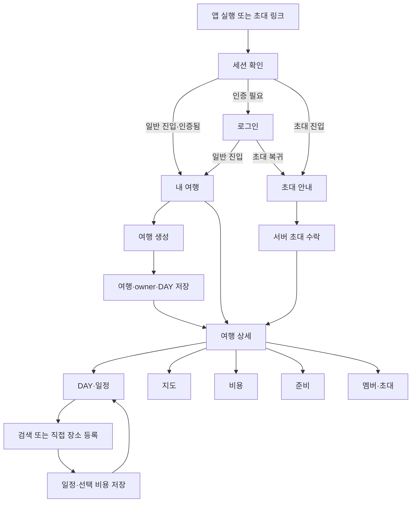

# WHEREGO 사용자 흐름과 화면 명세

- 버전: v0.1 / 작성일: 2026-10-02 / 상태: 제안 설계
- 관련: [기능](FEATURE_SPEC.md), [정책](POLICY_DECISIONS.md), [저장](DATA_STORAGE_SPEC.md)
- 기존 라우트는 현황 표시이며 “제안” 라우트/모달은 신규 구현 대상이다.

## 1. 정보 구조와 이동 원칙

MVP 하단 내비게이션은 현재 구조를 활용해 내 여행/발자국/마이 3개로 유지하는 권장안이다. 발자국은 P1이므로 MVP에서 빈 기록 안내 또는 제공 예정 화면으로 둔다. 여행의 일정/지도/비용/준비/멤버는 한 여행 상세 안에서 전환한다. 별도 홈·전체 지도 메뉴를 추가하지 않는다.

이동 후에도 동일한 서버 여행 ID를 사용한다. 뒤로 가기는 탭 내부 편집→상세→목록 순이다. 저장되지 않은 변경이 있을 때 “계속 작성/나가기”를 제공하고 저장 성공 후에는 같은 경고를 반복하지 않는다.

## 2. 사용자 여정

### U-01 최초 사용자: 첫 계획 완성

1. BI/CI 진입 후 세션 확인. 신규 사용자는 로그인 화면에서 핵심 가치와 둘러보기 안내를 본다.
2. 로그인 완료 후 내 여행의 “아직 여행이 없어요”와 “여행 만들기”를 본다.
3. 국가·도시·기간 입력, 기본 시간대 확인. 제목은 자동 제안한다.
4. 저장 중 버튼 비활성. 서버가 여행/DAY를 모두 저장하면 DAY1 상세로 이동한다.
5. 일정 빈 상태의 “첫 일정 추가” → PLACE → 검색 또는 직접 등록.
6. 장소·시각·메모·선택 예상비용 저장. 일정 카드·지도·비용에서 같은 값을 확인한다.
7. 앱 종료 후 재접속해 동일 여행과 일정을 확인한다. 이 단계까지가 첫 사용자 인수 흐름이다.

### U-02 공동 계획

1. A가 멤버 탭에서 editor 초대를 생성하고 링크를 전달한다.
2. B는 초대 대상·역할·기간·만료를 최소 정보로 확인한다. 비인증이면 로그인 후 초대 복귀.
3. 명시적으로 “참여하기” 선택 → 서버 수락 → 상세의 내 역할 표시.
4. B가 DAY3 일정을 추가. A는 재진입/당겨서 새로고침으로 반영을 확인한다.
5. viewer C는 읽기 화면과 “조회 권한” 배지를 본다. 편집 버튼은 표시하지 않는다.
6. 편집 중 제거된 B는 저장 시 권한 오류를 받는다. 입력을 서버 성공으로 표시하지 않고 목록으로 안내한다.

### U-03 재방문과 계획 변경

1. 세션 복원 → 내 여행 조회 → 진행 중/예정 여행 선택.
2. 이전 상세 탭과 DAY는 같은 계정·같은 여행에 한해 UI 상태로 복원한다. 삭제된 DAY이면 DAY1로 조정한다.
3. 일정 수정은 기존 내용 로드 → 변경 → 서버 버전 검사 → 성공 반영.
4. 기간 축소는 제외되는 DAY와 일정/비용 개수를 미리 보여준다. 데이터가 있으면 변경 차단, 각 항목 이동·연결 해제를 안내한다.
5. 충돌이면 최신 내용과 내 입력을 비교하고 다시 적용한다. 재시도만으로 타인의 변경을 덮어쓰지 않는다.

### U-04 현장 비용 입력

1. 비용 탭 → 실제 지출 추가 → 제목·금액·통화·선택 DAY/일정/결제자 입력.
2. 해당 일정 선택 시 DAY 자동 설정; 다른 여행 일정은 선택 불가.
3. 저장 성공 후 해당 통화의 실제합계·DAY합계를 갱신한다.
4. OCR 버튼은 P1 전 제공 예정 상태다. 영수증 없이 직접 입력할 수 있다.

## 3. 화면 목록

| 화면 ID | 화면·현행/제안 경로              | 요구사항     | 주요 목적                     |
| ------- | -------------------------------- | ------------ | ----------------------------- |
| S-01    | 스플래시 `/` 현행                | MVP-01       | 세션·앱 진입, 오류 복구       |
| S-02    | 로그인 `/login` 현행             | MVP-01       | 실제 인증과 원래 행동 복귀    |
| S-03    | 내 여행 `/(tabs)` 현행           | MVP-02/10    | 목록·필터·생성·초대 진입      |
| S-04    | 여행 생성/수정 모달 현행 확장    | MVP-02/03    | 목적지·기간·시간대·제목       |
| S-05    | 상세 `/trips/[id]` 현행          | 전 MVP       | 여행 헤더·역할·5개 탭         |
| S-06    | 상세 일정 탭 현행                | MVP-04       | DAY별 일정·수정·이동·순서     |
| S-07    | 일정 편집 모달 현행 확장         | MVP-04/05/08 | 유형·장소·시각·메모·예상비용  |
| S-08    | 장소 검색/직접 등록 시트 제안    | MVP-05       | 실제 장소 선택 또는 직접 입력 |
| S-09    | 상세 지도 탭 현행 교체           | MVP-06       | 저장 좌표·DAY별 마커          |
| S-10    | 상세 비용 탭·편집 모달 현행 확장 | MVP-08       | 통화별 예상/실제 항목·집계    |
| S-11    | 상세 준비 탭 현행 확장           | MVP-09       | 준비물 추가/편집/완료         |
| S-12    | 상세 멤버 탭 현행 확장           | MVP-07       | 역할·초대·철회·탈퇴           |
| S-13    | 초대 `/invite/[token]` 제안      | MVP-07       | 안내→인증→수락→여행           |
| S-14    | 마이 `/(tabs)/my` 현행           | MVP-01       | 기본 프로필·로그아웃          |
| S-15    | 발자국 `/(tabs)/footprints` 현행 | P1           | MVP는 빈 기록/예정 안내       |

S-13 앱 미설치 진입용 웹 초대 페이지는 권장 MVP 범위(D-03). 공개 여행 열람 페이지와 웹 플래너는 별도 범위다.

## 4. 공통 화면 상태

| 상태         | 표시와 동작                                                            |
| ------------ | ---------------------------------------------------------------------- |
| 최초 조회 중 | 로딩 자리표시, 아직 없는 데이터를 빈 상태로 확정하지 않음              |
| 빈 상태      | 한 문장 안내와 권한에 맞는 주 행동. viewer에게 생성 유도 금지          |
| 조회 실패    | 오류·재시도. 캐시가 있으면 이전 데이터/마지막 갱신 표시                |
| 편집 중      | 입력 검증은 해당 필드 아래 표시, 입력값 유지                           |
| 저장 중      | 중복 버튼 차단·이탈 경고, 확정 성공 안내 없음                          |
| 저장 성공    | 서버 결과로 닫기/갱신. 일정 추가는 선택 DAY 유지                       |
| 저장 실패    | 입력 유지·재시도, 응답 불명확 시 같은 요청 키로 결과 복구              |
| 오프라인     | 이전 데이터 읽기 표시. 신규 저장 차단, 자동 전송 대기 안내 금지        |
| 버전 충돌    | 최신 내용 확인/내 입력 다시 적용/취소 제공                             |
| 세션 만료    | 로그인 후 안전한 복귀. 아직 저장하지 않은 계정 데이터의 유지 여부 안내 |
| 권한 철회    | 편집 중지·관련 캐시 제거·목록 이동. 실패를 성공처럼 처리하지 않음      |

서버/SQL 명칭·보안 코드·복호화 문자열은 사용자 화면에 표시하지 않는다. 저장 확인은 “저장했어요”와 실제 데이터로 보여준다. 기술 점검은 개발 환경에서만 분리한다.

## 5. 화면별 동작 상세

### S-01/02 인증

일반 진입은 세션 유효성 확인 후 목록으로 이동한다. 로컬 버전 비교나 지연만으로 “최신 버전”·“모든 데이터 무결성 정상”을 표시하지 않는다. 시간 초과 시 재시도·로그인으로 진행할 수 있어야 한다.

소셜 인증 브라우저/SDK 취소는 오류 경보 대신 로그인 화면 유지. 인증 성공과 프로필 복구 완료를 확인한 후 다음 화면으로 간다. 초대 복귀 주소는 허용된 앱 내부 경로만 사용한다. 원문 토큰은 UI에 노출하지 않는다.

### S-03/04 목록·생성·수정

목록 헤더는 내 여행, 상태 필터, 생성 CTA다. 카드 선택은 서버 접근 확인 후 상세를 연다. 생성 폼은 필수 목적지/기간을 먼저 보여주고 제목/색상/통화는 추가 옵션으로 둔다. 키보드가 저장 버튼을 가리지 않게 한다.

수정 폼은 owner에게만 보인다. 기간 변경 확인에는 유지/추가/제외되는 날짜와 데이터 개수, 차단 사유를 표시한다. 삭제 확인은 여행명과 관련 데이터 삭제를 명시하고 취소를 기본으로 선택한다.

### S-05/06 상세·일정

헤더: 제목·목적지·기간·상태·내 역할·설정(owner). DAY에는 번호+월일+요일, 일정 카드에는 순서·시간(미정 포함)·유형·제목·선택 비용을 표시한다.

빈 DAY는 추가 CTA, viewer는 “아직 등록된 일정이 없어요”만 제공한다. 카드 더보기는 수정/다른 DAY로 이동/삭제다. 순서 편집은 드래그 외에 위/아래 이동을 제공해 터치·키보드 접근을 지원한다. 변경 순서 저장 후 재조회 결과가 기준이다.

### S-07/08 일정·장소

유형별 필드를 점진적으로 노출한다. 장소 선택 전 메모/시각을 입력해도 검색 시트 전환 후 보존한다. 검색어 권장 2자 이상, 검색 실행 버튼 지원; 자동 검색 지연 300ms는 권장 초깃값(D-15)이다.

검색 결과는 이름·주소·공급자 표시. 결과 선택 후 지도 미리보기/좌표 유무 확인, “이 장소 사용”으로 폼 복귀한다. 직접 등록은 이름+선택 주소/좌표; 없는 좌표를 강제로 입력하게 하지 않는다. 장소 없는 PLACE 또는 선택 장소 없는 STAY는 이름 기반 직접 등록으로 처리한다.

예상비용은 금액+통화다. 기존 비용이 있으면 동일 항목 편집이라는 문구를 보여줘 추가 비용으로 오해하지 않게 한다. 이동/숙박 세부 예약 구조는 MVP 메모 입력으로 한정한다.

### S-09 지도

선택 DAY 유지, 마커/아래 일정 목록 연계, 전체 지점 보기. 좌표 없는 항목 개수 안내와 해당 일정 수정 진입. 마커 없음과 지도 실패를 다른 상태로 표시한다. GPS 권한 없이 저장 장소를 확인할 수 있다.

마커 번호는 일정 전체 순서다. 직선 연결이 있는 경우 실제 교통 경로가 아니라는 표시를 붙인다. 실제 안내가 없으면 예상 이동시간을 만들어 표시하지 않는다.

### S-10 비용

예상/실제 전환 및 통화 필터, 여행/선택 DAY/공통 비용 보기, 카테고리·항목 목록을 제공한다. 통화별 합계와 차이를 표시하며 통화가 다르면 하나의 비율 막대로 비교하지 않는다.

항목 추가/수정: 제목·금액·통화·카테고리·DAY/일정·결제자. 예상 항목의 “실제 지출로 기록”은 기존 예상값을 남기고 새 실제 항목을 만든다. 삭제 후 목록/집계 갱신.

### S-11 준비

전체/완료 개수, 추가 입력, 각 항목 체크/편집/삭제. 요청 중 해당 항목 비활성. 실패 시 서버 확인된 상태로 복구하고 안내한다. 완료 상태를 색상만으로 구분하지 않는다.

### S-12/13 멤버·초대

멤버 목록에는 닉네임·역할·본인 배지만 표시한다. 전화번호/로그인 제공자·접속 기기 정보는 표시하지 않는다. owner의 초대 생성 시 역할·유효기간·한 명 참여 가능 안내를 제공한다.

초대 페이지는 여행 제목·목적지·기간·예정 역할만 최소로 보여준다. 비용·일정 상세·멤버 목록은 수락 전 비노출. 만료/철회/사용 완료는 새 링크 요청 안내, 이미 멤버면 “여행 열기”. 로그인/수락 중 실패 시 재시도하되 중복 멤버 생성 금지.

### S-14/15 마이·발자국

마이 기본 정보 수정은 서버 성공 후 확정한다. 로그아웃 시 미저장 편집이 있으면 안내한다. GPS·오프라인 설정은 실제 제공 기능과 연결되기 전 효력이 있는 토글처럼 제공하지 않는다.

발자국은 P1 전에 허위 인증·후기 저장 성공을 보여주지 않는다. 기록 기능 제공 예정 안내와 내 여행으로 돌아가는 행동을 제공한다.

## 6. 접근성과 플랫폼

버튼은 아이콘만 있어도 이름을 제공하고 선택 탭·DAY·체크 상태를 스크린리더로 구분한다. 검증 오류 후 해당 입력으로 초점을 옮기고 동작 결과를 안내한다. 확대 글꼴에서도 주요 액션과 금액이 잘리지 않게 한다. 모바일 한 손 조작과 웹 키보드 입력 모두 검증한다.

웹에서 새로고침/직접 링크 진입은 라우트별 인증과 복귀를 유지한다. 플랫폼별 로그인·뒤로 가기·링크 처리는 같은 사용자 결과를 목표로 검증하며 현재 웹 export 성공만으로 인수하지 않는다.
